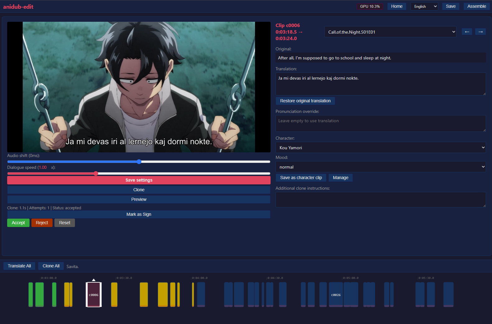
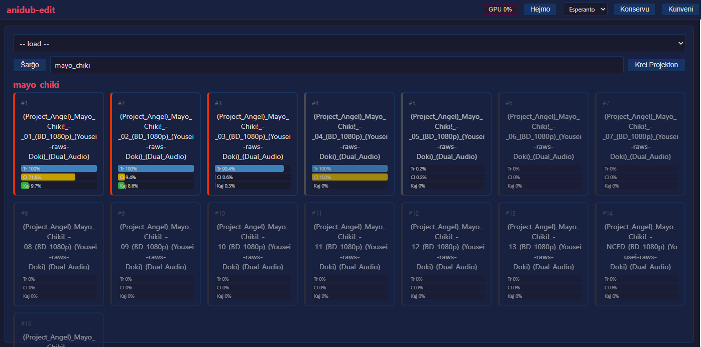
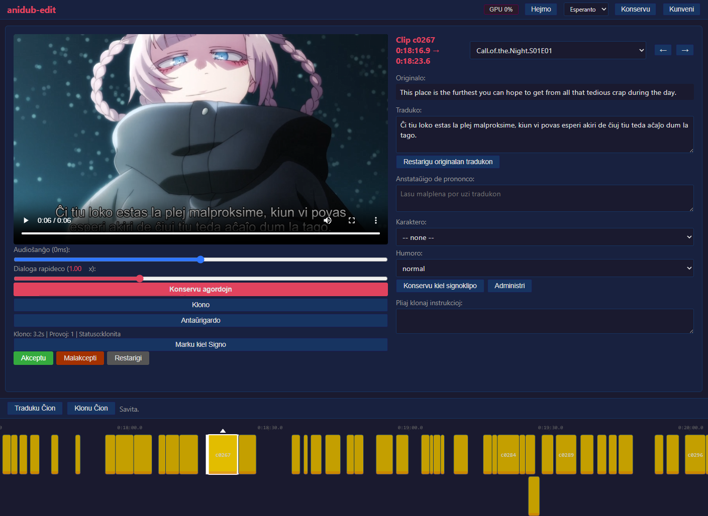
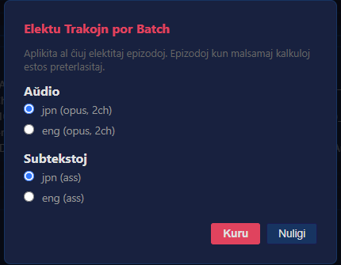
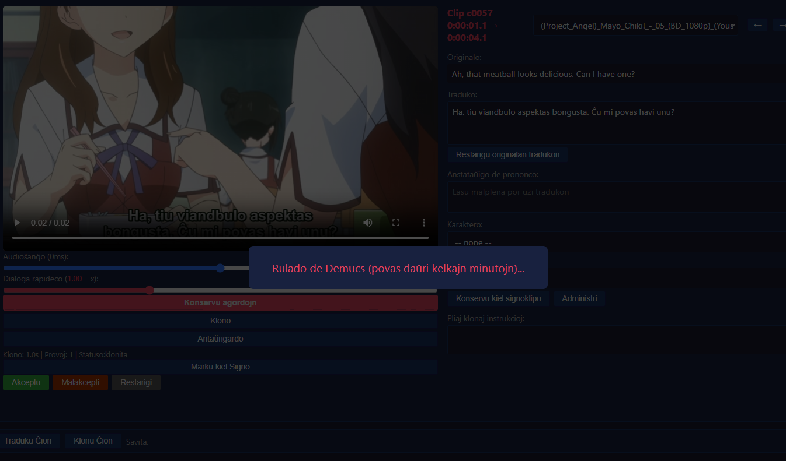
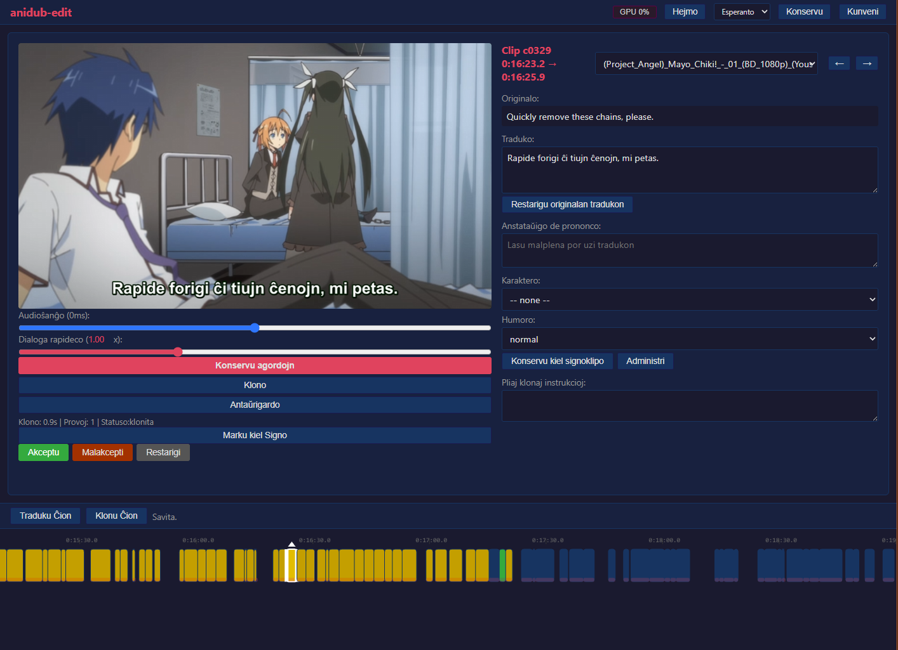
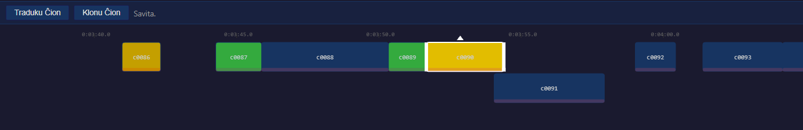
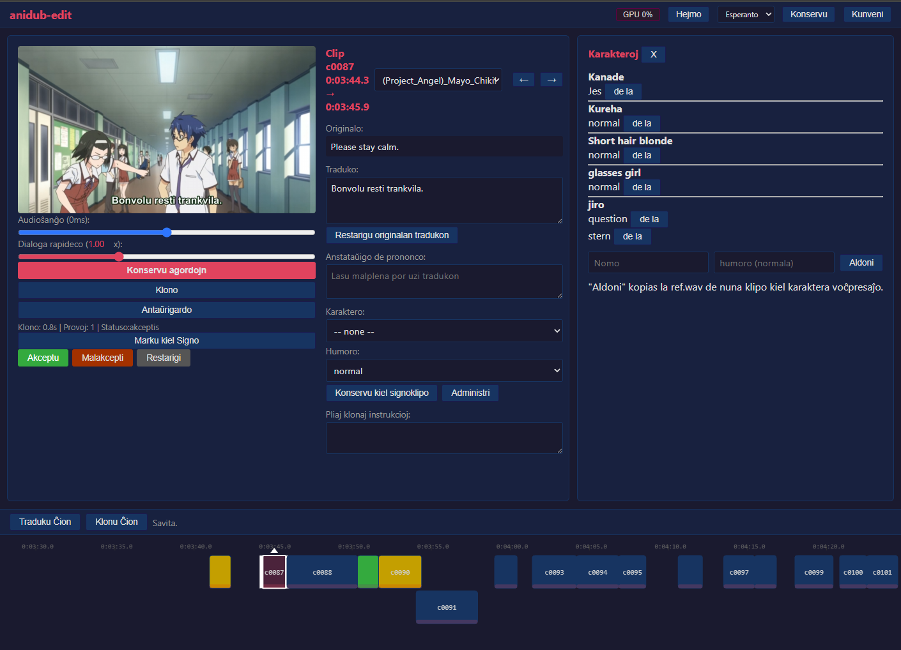
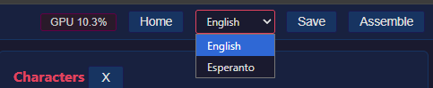

# AniDub EO

Animedubla dukto: apartigu audio en fonon + kanton, traduku japanajn subtekstojn al Esperanto, poste kreu Esperantajn voĉajn trakojn per la OmniVoice (k2-fsa) TTS-modelo. Ĉiuj dubladaj laboroj okazas en retumila redaktilo - neniuj CLI-laborfluaj komandoj necesas.

## Malgarantio

**Ĉi tio estas persona projekto evoluigita kaj testita sur specifa maŝino.**

| Component | Detail |
|-----------|--------|
| **GPU** | NVIDIA GeForce RTX 5060 (Blackwell architecture) |
| **VRAM** | 8 GB |
| **CUDA** | 12.8 |
| **OS** | Windows 11 |
| **Python** | 3.10+ |

Ĝi eble ne funkcias ĉe aliaj GPU-oj, CUDA-versioj aŭ operaciumoj. Uzas `~6 GB' de VRAM dum inferenco. Unue elŝutas `~2.5 GB` de modelaj pezoj. **YMMV.**

---

## Postuloj

- **Vindozo** (provita je 11; PowerShell bezonata por `install.ps1`)
- **Python 3.10+**
- **NVIDIA GPU** kun CUDA 12.8+-subteno (Blackwell optimumigita; eble funkcias sur pli malnovaj arkitekturoj)
- **ffmpeg** (aŭtomate elŝutita de `install.ps1`)
- **Elŝutoj de modeloj** (aŭtomataj dum la unua funkciado):
- `k2-fsa/OmniVoice` — ~2.5 GB
- `openai/flustre-eta` — ~150 MB
- `htdemucs` (Demucs) — ~160 MB

---

## Rapida Instalo

```powershell
# 1. Clone the repo
git clone <repo-url> "omnivoice"
cd "omnivoice"

# 2. Run the installer (creates .venv, installs PyTorch CUDA, deps, ffmpeg)
.\install.ps1

# 3. Register CLI commands
.\.venv\Scripts\Activate.ps1
pip install -e .
```

Se vi preterlasas `install.ps1` kaj uzas vian propran venv, instalu permane:

```powershell
pip install torch torchvision torchaudio --index-url https://download.pytorch.org/whl/cu128
pip install demucs omnivoice deep-translator rich soundfile
pip install -e .
```

---

## Eniga Dosiera Strukturo

Metu vian animeon en `anime/{name}/`. Ĉiu dosierujo enhavas unu aŭ plurajn MKV-ojn kaj laŭvolajn ASS-subtitolojn.

```
anime/
├── gabriel_dropout/
│   ├── Gabriel.DropOut.S00E02.mkv            # OVA
│   ├── Gabriel.DropOut.S00E02_eo.ass         # Pre-translated Esperanto subtitles
│   ├── Gabriel.DropOut.S01E03.1080p.BluRay.10-Bit.FLAC2.0.x265-YURASUKA.mkv
│   ├── Gabriel.DropOut.S01E04.1080p.BluRay.10-Bit.FLAC2.0.x265-YURASUKA.mkv
│   └── ... (S01E05 – S01E12)
│
├── hxh/
│   ├── Hunter x Hunter (2011)S01E001.mkv
│   ├── Hunter x Hunter (2011)S01E002.mkv
│   └── ... (S01E003 – S01E148)
│
├── call_of_the_night/
│   ├── Call.of.the.Night.S01E01.mkv
│   └── Call.of.the.Night.S01E01_eo.ass
│
└── oreimo/
    ├── Oreimo - 01.mkv
    └── Oreimo - 01.ass
```

### MKV-postuloj

- Devas enhavi **subtitolan trakon de ASS** (enigita). Se ne estas enigita, provizu dosieron `.ass` apud la MKV.
- Devas enhavi **japanan sontrakon** (aŭ kiu ajn lingvo el kiu vi sinkronigas).
- Dosiernomoj povas sekvi ajnan konvencion. Epizodoj estas prilaboritaj en **alfabeta ordo**.

### ASS-subtitolaj postuloj

- Norma formato `.ass` kun sekcio `[Okazaĵoj]`.
- Dialoglinioj devas havi **`Stilo: ĉefa`** (aŭ `Defaŭlte`) por esti konsiderataj por dublado.
- Linioj kun "Stilo: OP" aŭ "Stilo: ED" estas traktataj kiel malfermaĵo/finaĵo kaj estas ekskluditaj de dublado (originala japana audio estas konservita por sekcioj OP/ED).
- Ne-Esperanta teksto (japanaj, CJK-signoj) estas aŭtomate preterpasita.
- Linioj komenciĝantaj ene de `< 1.0` sekundo de la epizodo estas preterlasitaj (neniu antaŭ-rula referencaŭdio).

### Esperantaj ASS-dosieroj

Se `_eo.ass` dosiero jam ekzistas por epizodo (ekz., `Gabriel.DropOut.S00E02_eo.ass`), ĝi estas uzata rekte. Alie, la redaktilo aŭtomate eltiras la enigitan japanan ASS-trakon, tradukas ĝin al Esperanto per Google Translate, kaj konservas ĝin kiel `{mkv_stem}_eo.ass` en la animea dosierujo.

---

## Komencante la Redakton

```powershell
anidub-edit
```

Malfermas `http://127.0.0.1:5000` en via retumilo. Laŭvolaj flagoj: `--port N`, `--host ADDR`, `--project PATH` (malfermu ekzistantan projekton dum ekfunkciigo).

<!-- SCREENCAP: anidub-edit window just opened, empty home screen -->

---

## 1. Krei Projekton

Enigu la nomon de la dosierujo de animeo (ekz. `gabriel_dropout`) en la tekstujon sur la hejma panelo kaj alklaku **Krei Projekton**. La redaktisto malkovras ĉiujn MKV-ojn en tiu dosierujo, ĉerpas iliajn aŭdajn/subtitolojn, kaj montras ĉiun epizodon kiel karton sur la hejmekrano.

Por remalfermi ekzistantan projekton, elektu ĝin el la menuo ĉe la supro de la hejma panelo kaj alklaku **Ŝargi**.

<!-- SCREENCAP: home screen with episode cards populated, showing Tr/Cl/Ac progress bars -->

---

## 2. Malfermo de Epizodo

Duoble alklaku epizodkarton por malfermi la redaktilon.

- **Maldekstra panelo** — videa antaŭrigardo, krom la sonŝanĝo, dialograpideco kaj po-klipo butonoj (Kloni, Antaŭrigardi, Akcepti, Malakcepti, Restarigi).
- **Dekstra panelo** — nuna klipokapo, originala teksto, traduka tekstkesto, prononco superregado, karaktero + humor-elektiloj, pliaj klonaj instrukcioj.
- **Malsupro** — templinibreto montranta ĉiun klipo en la epizodo, kolorkodita laŭ stato.

<!-- SCREENCAP: editor view with a clip loaded, left + right panes visible -->

---

## 3. Aŭdio + Subtitolaj Trakoj

Kiam vi ekigas **Batch Translate** aŭ **Batch Clone** en pluraj epizodoj, la redaktilo malfermas trak-elektilan modalon:

- Elektu la **japanan sontrakon** (kutime tiun etikeditan `jpn`).
- Elektu la **ASS-subtitolon**.
- Ĉi tiuj elektoj validas por ĉiuj elektitaj epizodoj; epizodoj kun malsamaj trakkalkuloj estas preterpasitaj kaj raportitaj.

Por unu-epizodo malfermita, la redaktilo aŭtomate elektas la unuajn sonajn + subtitolojn. Epizodkartoj jam devas esti starigitaj per la modalo antaŭ ol ruli batajn operaciojn.

<!-- SCREENCAP: track-picker modal showing audio and subtitle radio choices -->

---

## 4. Demucs Apartigo

La unuan fojon kiam vi malfermas epizodon, la redaktilo aŭtomate rulas Demucs (`htdemucs`) por dividi la ŝirita audio en:

- `vocals.wav` (originaj japanaj voĉoj)
- `no_vocals.wav` (fona muziko + SFX)

Ĉi tio funkcias unufoje por epizodo kaj povas daŭri kelkajn minutojn. Statuskovraĵo montras progreson.

<!-- SCREENCAP: "Running Demucs (may take a few minutes)..." overlay -->

---

## 5. Tradukado

Tri manieroj traduki subtitolliniojn al Esperanto:

- **Traduku Ĉion** (granda stango malsupre) — tradukas ĉiun atendantan klipon en la nuna epizodo per Google Translate (aŭtomata detekto → Esperanto).
- **Batch Translate** (hejma ekrano, post Shift-klakado de pluraj epizodkartoj) - tradukas ĉiujn elektitajn epizodojn samtempe, instigante sonajn/subtitolojn.
- **Per-klipo** — tajpu manan tradukon en la **Traduko** teksta areo sur la dekstra panelo, tiam alklaku **Konservi agordojn**. Aŭ alklaku **Restarigi originalan tradukon** por refunkciigi Google Translate en ĉi tiu klipo.

Tradukitaj linioj estas videblaj tuj en la dekstra panelo. La statuso de la klipo ŝanĝiĝas de `pritraktata` al `tradukita`.

<!-- SCREENCAP: clip with original text + translation box filled, status showing "translated" -->

---

## 6. Voĉa Klonado

Tri manieroj generi Esperanto-voĉon:

- **Klonu Ĉion** (granda trinkejo) - klonas ĉiun tradukitan klipon en la nuna epizodo.
- **Batch Clone** (hejma ekrano) - klonas ĉiujn elektitajn epizodojn samtempe.
- **Klono per klipo** (maldekstra panelo) — klonas nur la nuntempe ŝargitan klipo.

OmniVoice (k2-fsa) generas Esperanto-paroladon klonitan el ~3-sekunda referencklipo de la origina japana aktoro. La modelo TTS restas en VRAM inter manaj klonoj por rapida ripeto; se VRAM-uzado superas 75% antaŭ klono, la komuna modelo estas aŭtomate malŝarĝita kaj rekreita. Vivaj tensoroj, rezervita memoro kaj aktivaj TTS-backends estas videblaj en la GPU-panelo (vidu [GPU Memoro-Panelo](#gpu-memory-panel)).

<!-- SCREENCAP: editor after a successful clone, clone-info string showing inference time and status -->

---

## 7. Revizio

- Butono **Antaŭrigardo** — ludas la videon kun la klonita Esperanta voĉo miksita super la originala fonaŭdio.
- **Aŭdioŝanĝo-glitilo** (-500ms al +500ms) — fajnagordas la tempan ofseton de la klonita voĉo. Ĝisdatigas la ruĝan aŭd-offset-tenilon de la templinio en reala tempo.
- **Dialogo-rapida glitilo** (0,50× al 2,00×) — aplikata per ffmpeg `atempo` dum miksado.
- **Akceptu / Malakcepti / Restarigi** — `Akceptu` markas la klipo farita kaj antaŭeniras al la sekva neakceptita klipo; `Reject` markas ĝin por reklonado; `Restarigi` forigas tradukon + klonon.
- **Tempolinia stango** (malsupre) - ĉiu klipo montrita kiel kolora bloko laŭ stato:
- `pritraktata` (malhela), `tradukante` (purpura), `tradukita` (blua),
- "klonita" (oro), "akceptita" (verda), "malakceptita" (ruĝa),
- `ne_dub` (griza), `signo` (kreko, elkovita).
- Trenu blokajn randojn por regrandigi la tempigfenestron de klipo.
- Trenu la ruĝan tenilon ĉe la fundo de klipo por puŝi ĝian sonan ofseton.
- Dekstre alklaku klipo por **Forigi klipo** aŭ **Ŝanku signon/aŭdon**.

<!-- SCREENCAP: timeline bar showing mixed-status clips, with the current clip highlighted -->

---

## 8. Karakteroj & Humoroj

Por reuzi voĉan presaĵon tra epizodoj:

1. Ŝarĝu klipo, kies voĉon vi volas konservi.
2. Elektu **karakteran** nomon el la menuo (aŭ tajpu novan).
3. Elektu **Humoron** (defaŭlte al `normala`).
4. Klaku **Konservi kiel signoklipo** — ĉi tio kopias la `ref.wav` de la nuna klipo en karakteran voĉbibliotekon.

La butono **Administri** malfermas la signopanelon, kiu listigas ĉiun signan×humoran paron kaj ebligas al vi forigi individuajn enskribojn. Antaŭ kloni, agordu la menuojn Karaktero + Humoro — OmniVoice uzos tiun voĉan presaĵon por la generita klipo.

<!-- SCREENCAP: character Manage panel showing multiple characters with moods -->

---

## 9. Signoj / Ne-Dubitaj Klipoj

Kelkaj subtitolaj linioj ne estas dialogaj (surekranaj signoj, titoloj) kaj ne devus esti voĉigitaj.

- Alklaku **Marki kiel Signon** sur la maldekstra panelo por ŝanĝi la staton de la aktuala klipo al `signo'. La butonetikedo turniĝas al **Marki kiel Vokalo** kiam stato estas "signo".
- Dekstre alklaku templinian klipon → **Alklaku signon/aŭdon** por fari la samon de la templinio.
- `Signo`-klipoj konservas originalajn aŭdaĵojn kaj subtekstojn, kaj estas preterlasitaj dum klonado kaj muntado. Ili bildigas kun elkovita ŝablono sur la templinio.

La redaktilo aŭtomate detektas kelkajn ne-dublajn klipoj (neniu uzebla referencaŭdio, teksto tro mallonga, ktp.) kaj markas ilin `ne_dub`; ĉi tiuj ne povas esti ŝanĝitaj reen al `signo`.

---

## 10. Kunvenado

Alklaku ** Kunmeti ** en la supra trinkejo por konstrui la plenan sinkronigitan epizodon el ĉiuj akceptitaj klipoj:

- Voĉaj linioj anstataŭigas la originajn japanajn voĉojn.
- Sekcioj OP/ED konservas originalan aŭdion.
- Interspacoj > 2 sekundoj inter linioj estas plenigitaj per originala audio.
- Eraro / saltitaj linioj estas plenigitaj per originala audio.
- Videofluo estas kopiita (neniu rekodigo).
- Sontrako 1: AAC 256k (Esperanto dub); Sontrako 2: originala japana (kopio).
- Subtitolo: kopio.

Eligo: `projects/{anime}/{epizodo}/out/{epizodo}_Dubbed.mkv`. Finigaj dialogoj montras la finan vojon.

Por preterlasi epizodon en estontaj grupaj kuroj, marku ĝin **Kompleta** (po-epizoda flago).

<!-- SCREENCAP: completion dialog showing the final assembled .mkv path -->

---

## GPU Memorpanelo

Alklaku la indikilon **GPU --%** en la supra-dekstra de la kaplinio por malfermi la GPU-panelon:

- **Vivaj tensoroj** — VRAM asignita de aktivaj tensoroj.
- **Rezervita (ŝoforo)** — VRAM tenita de la kaŝa alsignilo.
- **% rezervita** — frakcio de totala VRAM rezervita.
- **Vivaj modeloj** — nomoj de aktivaj TTS-backends (inkluzive `Shared (manual clones)' por la longdaŭra unu-klipa backend).

Butonoj:

- **Malpurigi GPU-Memorion** — liberigas la rezervitan sed neasignitan naĝejon (malpezan).
- **Force Unload Models** — forigas ĉiun ŝarĝitan OmniVoice + Whisper-backend de VRAM (pli peza; reformas la liston de vivmodeloj al "Neniu vivaj TTS-modeloj ŝarĝitaj").

<!-- SCREENCAP: GPU panel open showing device, live tensors, reserved bar, and live backends -->

---

## Lingvo-Selektilo

Apud la butono **Hejmo**, falmenuo **Lingvo** ebligas al vi ŝanĝi la redaktilan UI inter:

- **La angla** (defaŭlte)
- **Esperanto**

La elekto estas konservita en `localStorage', do ĝi daŭras tra foliumilaj sesioj. Ŝanĝi reprezentas la nunan klipo, epizodo-hejmon, templinion kaj GPU-panelon en la elektita lingvo. Statusaj enumvortoj (`pending`, `translated`, `cloned`, `akcepted`, `rejected`, `signo`, `ne_dub`) ankaŭ estas lokalizitaj; la templinia kolorkodado estas senŝanĝa.

<!-- SCREENCAP: header showing the language dropdown with Esperanto selected and UI text in Esperanto -->

---

## Kiel Ĝi Funkcias

Ĉiu subtitola linio trairas ĉi tiun dukton:

```
1. PARSE          Read .ass file, filter to "main" dialogue lines
                  Skip: empty text, Japanese text, music markers, no pre-roll
                  Skip: lines inside OP/ED time ranges

2. TRANSLATE      Google Translate (auto-detect → Esperanto)
                  Duplicate/progressive lines are auto-merged (--auto)
                  Writes {stem}_eo.ass in the anime folder

3. SEPARATE       Demucs (htdemucs) splits ripped audio into:
                  - vocals.wav   (original Japanese voices)
                  - no_vocals.wav (background music + SFX)

4. EXTRACT REF    ffmpeg clips ~3 seconds of original audio at the
                  subtitle's start time → ref.wav (24 kHz mono)

5. TRANSCRIBE     Whisper (tiny model) transcribes ref.wav in Japanese
                  to get the reference text for voice cloning

6. GENERATE       OmniVoice (k2-fsa) generates Esperanto speech:
                  - Voice cloned from ref.wav
                  - Duration matched to subtitle window
                  - Esperanto phonetics guide as instruct prompt

7. TRIM + FIT     Trim silence, then ffmpeg atempo speeds up audio
                  if it exceeds the subtitle window duration

8. MIX            ffmpeg mixes voice (0.8) + background (1.0)
                  → dubbed.wav

9. MUX            ffmpeg combines video + dubbed audio + subtitles
                  Video stream: copy (no re-encode)
                  Audio track 1: AAC 256k (Esperanto dub)
                  Audio track 2: copy (original Japanese)
                  Subtitle track: copy
                  → final.mkv
```

Post kiam ĉiuj linioj estas voĉigitaj, `build_full_episode()` kunvenas la kompletan epizodon:
- Voĉaj linioj anstataŭigas la originajn japanajn voĉojn
- Sekcioj OP/ED konservas originalan aŭdion
- Interspacoj > 2 sekundoj inter linioj estas plenigitaj per originala audio
- Eraraj linioj estas plenigitaj per originala audio

---

## Konataj Problemoj

### Google Translate 500-eraroj
Foje liveras HTTP 500. La tradukpaŝo aŭtomate provas unufoje post 30 sekundoj. Se ĝi ankoraŭ malsukcesas, la linio konservas sian originalan tekston (markita kiel malsukcesa en la protokolo).

### Timeout kaskadoj
Se linio elĉerpiĝas (blokita en GPU-generacio), postaj linioj ankaŭ povas kuri malrapide aŭ elĉerpiĝas ĉar la forlasita fadeno daŭre tenas GPU-memoron. Kiam tempoforigo estas detektita, la TTS-backend estas **detruita kaj rekreita** post 30-sekunda malvarmigo por liberigi la CUDA-kuntekston.

### Unuaj elŝutoj de modeloj
La sekvantaroj estas elŝutitaj laŭ unua inferenco:
- `k2-fsa/OmniVoice` (~2.5 GB)
- `openai/whisper-tiny` (~150 MB)
- `htdemucs` pezoj (~160 MB)

Atendu kelkajn minutojn da elŝuto antaŭ ol la unua linio estas voĉigita.

---

## Solvado de problemoj

| Problem | Fix |
|---------|-----|
| `ffmpeg not found` | Run `.\install.ps1` or ensure `ffmpeg\bin\ffmpeg.exe` exists |
| `CUDA out of memory` | Close other GPU applications; `torch.cuda.empty_cache()` is called between lines |
| All lines skipped | Check ASS styles — dialogue must be `Style: main`; verify text is Esperanto (not Japanese) |
| Original Japanese voices not removed | Demucs cache is at `{output_dir}/full_no_vocals.wav` — delete it to force re-separation |
| Episode uses wrong subtitles | Delete the stale `_eo.ass` file and re-open the episode; the editor will re-extract + re-translate |